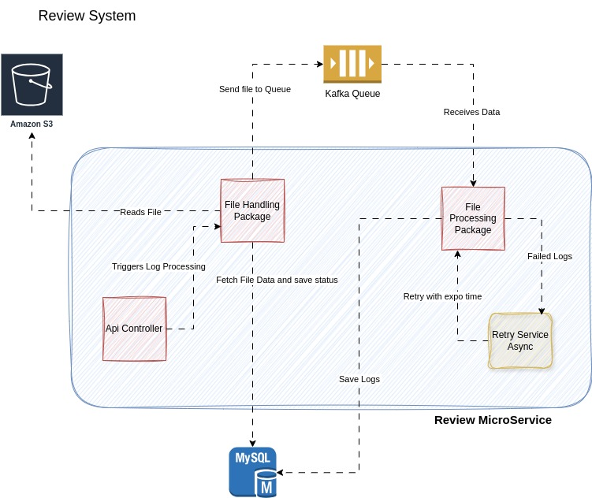

# ETL - S3 Logs to DB using Kafka

## System Design


# Key Features
### S3 File Fetching
1. Uses AWS SDK to connect to S3.
2. Lists objects in a specific bucket/prefix.

### Idempotancy
1. **Idempotancy at File Level**: Maintain file processing status in DB. Only if file is processed, status will be changed to False/True. This way no duplicate file will be processed.
2. **Idempotancy at Line Level**: Check review_id for the hotel_id and provider_id against each rating. If same, data has already been added to the db.

### JSON Lines Parsing
1. Uses BufferedReader to read each .jl file line by line.
2. Validates required fields.

### Retry
1. Once data is parsed and error caused while saving to db. Data gets re-processed up to the threshold defined (Constant file). Later it will be logged under [retry.log](logs/retry.log) to investigate.

### Database Storage
1. Uses Spring Data JPA to persist data.
2. **Optional**: Can Support normalized schema design for readability of logs. If reads are high, can store in Cache as well.
3. **Optional**: Can store raw data for further investigation when required.

### Log Process via Api
``` bash
Post http://localhost:8080/v1/reviews/process
```
### Logging
1. All Info,Warn,Error,etc. are logged in [application.log](logs/application.log).

### Dockerized
1. Dockerfile for
   2. Mysql: runs sql script
   3. Runs Jar after mysql is updated (code commented).
2. docker-compose.yml with MySql service

# DB Schema
#### SQL file is stored at [review.sql](sql/review.sql)
## Table
**Multiple Tables are created keeping in the mind for scalability and manageability.**
1. **files** : Stored status of file by provider
2. **hotels** :  Stores Hotels data (Radisson, Taj, ...)
3. **providers** : Stores Providers data (extendable).
4. **reviews** : Stores individual reviews.
5. **reviewers** : Stores info about the reviewer.
6. **rating_summary** : Stores the overall scores of hotel for a provider.
7. **ratings** : Stores ratings breakdown (extendable).
8. **rating_category** : Stores category, like cleanliness, vfm, comfort, etc. (extendable).
9. **language** : Stores languages (extendable).
### Clear all Data and autogenerated columns
``` bash
SELECT DATABASE();
USE logs;
TRUNCATE TABLE reviews;
ALTER TABLE reviews AUTO_INCREMENT = 1;

TRUNCATE TABLE reviewers;
ALTER TABLE reviewers AUTO_INCREMENT = 1;

TRUNCATE TABLE hotels;
ALTER TABLE hotels AUTO_INCREMENT = 1;

TRUNCATE TABLE ratings;
ALTER TABLE ratings AUTO_INCREMENT = 1;

TRUNCATE TABLE rating_summary;
ALTER TABLE rating_summary AUTO_INCREMENT = 1;

TRUNCATE TABLE files;
ALTER TABLE files AUTO_INCREMENT = 1;

```
## Assumptions & Actions
1. Process about 500 logs files per minute.  
2. Provider updates files multiple times in a day. File structure.  
   1. Format: *S3://bucket/prefix/yyyy/mm/dd/filename.jl*
   2. example: *s3://reviews/logs/2025/05/26/review01.jl*

3. Listing of files will be fetched by pagination.  
   1. AWS credentials are not available, please use your own creds. Aws config is mentioned in the provider table under cloud_info.    
   2. Added a demo code to pick all files from local folder  [jsonFiles](src/main/resources/jsonFiles)
4. Each File size is as big as demo file provided **[agoda_com_2025-04-10.jl](src/main/resources/jsonFiles/agoda_com_2025-04-10.jl)**
5. Using Threads to achieve non-blocking process.
6. Only Mysql, kafka, zookeeper run inside container.
7. Java 21 is used.
8. Retry when Log Fails writing to DB.
9. Used Adapter, Factory and strategy design patterns.
10. System is able to extend functionalities for the followings:
    1. Extend for more Providers
    2. Extend to add more Cloud providers (aws, gcp, azure, etc).
    3. Extend to support multiple file formats (json, jl, csv, tab,etc.)
    4. Extend to support different data format of file.
    5. Extend to add languages.
    6. Extend to add Rating categories (Clean, value for money, etc.).

## Setup Project
**NOTE: Run mysql before jar**

### Setup Mysql in container
#### Build and start the containers:
port: **3307:3306**
``` bash
docker-compose up --build

// run as daemon
docker-compose up --build -d
```
#### View the logs:
``` bash
docker-compose logs
```
#### Stop the containers:
``` bash
docker-compose down
```

### Setup Java Code
Clone Repository from https://github.com/kkgautam01/s3-logs-to-db.git
``` bash
//clone repo
git clone https://github.com/kkgautam01/s3-logs-to-db.git

//build jar
mvn clean package

//run jar
sudo java -jar target/s3todb-1.0-SNAPSHOT.jar
```
### Sample review.jl

``` bash
{
  "hotelId": 10984,
  "platform": "Agoda",
  "hotelName": "Oscar Saigon Hotel",
  "comment": {
    "isShowReviewResponse": false,
    "hotelReviewId": 948353737,
    "providerId": 332,
    "rating": 6.4,
    "checkInDateMonthAndYear": "April 2025",
    "encryptedReviewData": "cZwJ6a6ZoFX2W5WwVXaJkA==",
    "formattedRating": "6.4",
    "formattedReviewDate": "April 10, 2025",
    "ratingText": "Good",
    "responderName": "Oscar Saigon Hotel",
    "responseDateText": "",
    "responseTranslateSource": "en",
    "reviewComments": "Hotel room is basic and very small. not much like pictures. few areas were getting repaired. but since location is so accessible from all main areas in district-1, i would prefer to stay here again. Staff was good.",
    "reviewNegatives": "",
    "reviewPositives": "",
    "reviewProviderLogo": "",
    "reviewProviderText": "Agoda",
    "reviewTitle": "Perfect location and safe but hotel under renovation ",
    "translateSource": "en",
    "translateTarget": "en",
    "reviewDate": "2025-04-10T05:37:00+07:00",
    "reviewerInfo": {
      "countryName": "India",
      "displayMemberName": "********",
      "flagName": "in",
      "reviewGroupName": "Solo traveler",
      "roomTypeName": "Premium Deluxe Double Room",
      "countryId": 35,
      "lengthOfStay": 2,
      "reviewGroupId": 3,
      "roomTypeId": 0,
      "reviewerReviewedCount": 0,
      "isExpertReviewer": false,
      "isShowGlobalIcon": false,
      "isShowReviewedCount": false
    },
    "originalTitle": "",
    "originalComment": "",
    "formattedResponseDate": ""
  },
  "overallByProviders": [
    {
      "providerId": 332,
      "provider": "Agoda",
      "overallScore": 7.9,
      "reviewCount": 7070,
      "grades": {
        "Cleanliness": 7.7,
        "Facilities": 7.2,
        "Location": 9.1,
        "Room comfort and quality": 7.5,
        "Service": 7.8,
        "Value for money": 7.8
      }
    }
  ]
}
```
